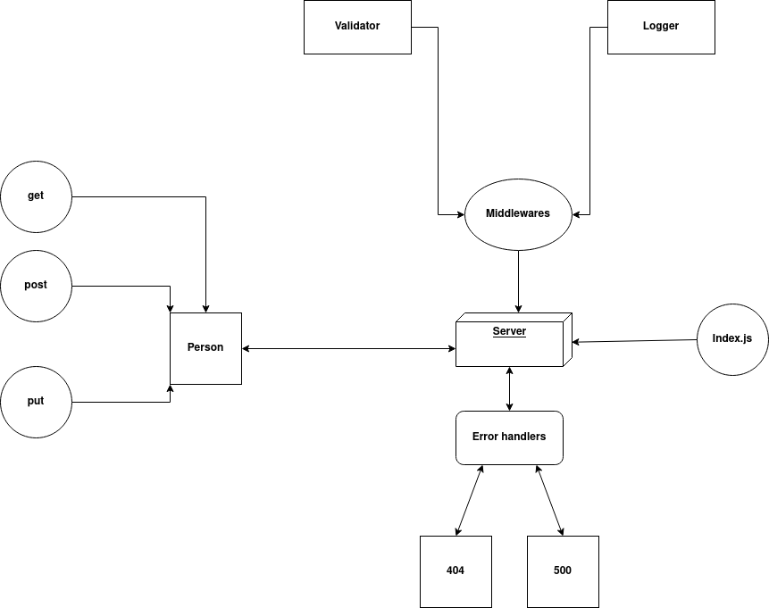

# basic-express-server

## About

A basic express server that can use CRUD operations, it also includes server modularization, use of middleware, error handlers and tests.

<hr>

## Author

#### Amjad Mesmar

<hr>

## Links

- [Repo](https://github.com/AmjadMesmar/basic-express-server)

- [Actions](https://github.com/AmjadMesmar/basic-express-server/actions)

- [Submission Pull Request](https://github.com/AmjadMesmar/basic-express-server/pull/5)

- [Heroku](https://souls-basic-express-server.herokuapp.com/)

<hr>

## Setup

### Install the following dependencies

```

  "dependencies": {
    "dotenv": "^9.0.2",
    "express": "^4.17.1"
  },
  "devDependencies": {
    "jest": "^26.6.3",
    "supertest": "^6.1.3"
  }

```

<br>

### .env variables

```
PORT=5000
```

<br>

## Running the app

1. Clone the repository.
2. Go to the repository's root directory.
3. Istall needed dependencies.
4. Fill .env data.
5. Write in terminal 'nodemon'.

<br>

## Endpoints

### `*/person/?name=amjad`

- ***Method: get***
- ***Returns a JSON data***

```

-----------------------------------------------------------------------
{
    "name": "amjad"
}

```

### `*/person`

- ***Method: post***
- ***Filed JSON body with a name***
- ***Returns a JSON data***

```

-----------------------------------------------------------------------
{
    "name": "John Doe"
}

```

## Test

- To test the server write in terminal:

```
npm test
```

<br><br><br>

<hr>

<br><br>

## UML Diagram


